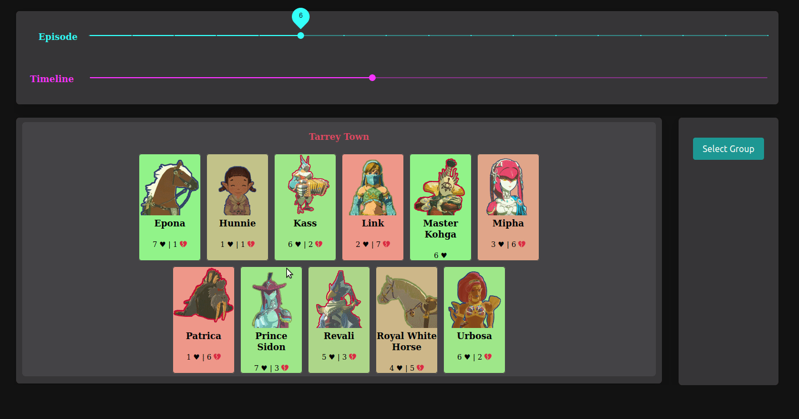
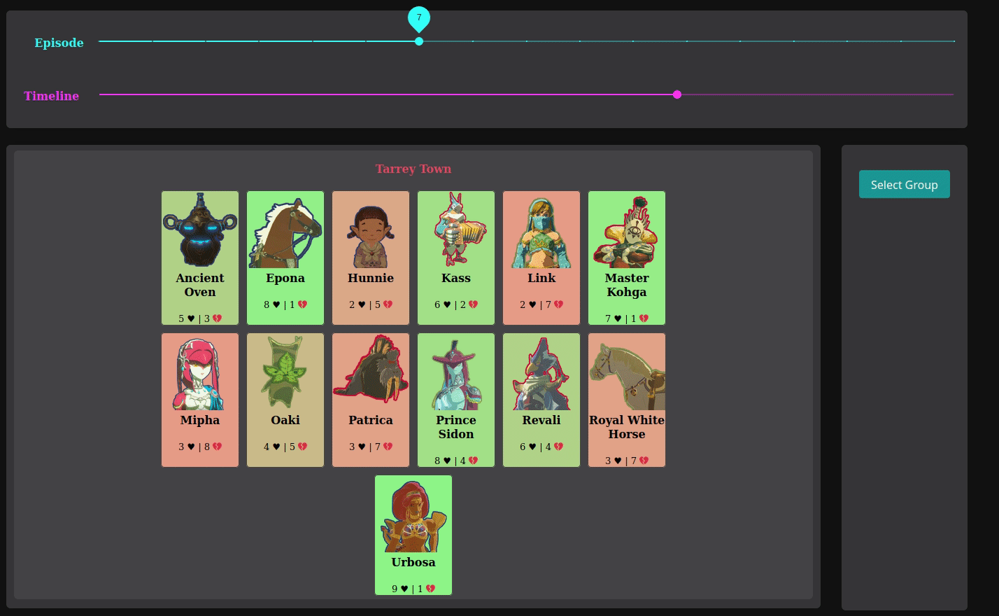
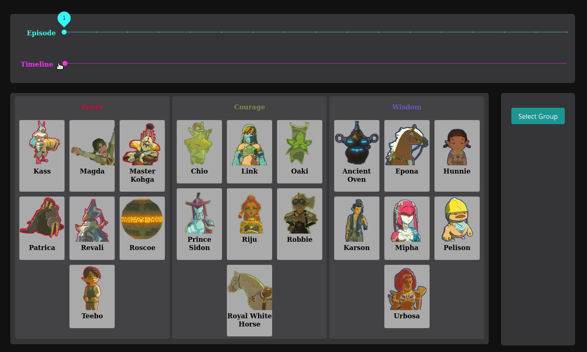

# Hi, welcome to Project LSG!

This is an experimental interface I made for visualizing social networks as they change over time. It uses real data, from a real online game, played by real people!  

\>\>\> https://spaulmark.github.io/project-lsg/ <<<

## Show, don't tell

You can click on players to see their opinions / what people think of them!

You can also select multiple people at once to see their collective opinions on people: good for finding common friends or enemies! 

Move through time using the sliders on the top! At the end of every episode, at least one player is eliminated (usually). Each episode corresponds to a real life timeframe of around 48 ~ 72 hours.

## What's the source on your data?

I spectated an online game of survivor, and kept track of the players's opinions on each other as the game progressed. Survivor is a game where the primary mechanic is that players eliminate each other by majority vote until only one winner remains, making it a good candidate for a social network analysis. Players voulenteered information to spectators in private forum threads. Because giving information to spectators was not compulsory, some players chose to give less information than others. As such, the data collected is not guarenteed to be 100% accurate or complete.

Here's a link to the forum where the game was played. Unless you've seen one of these before, you're probably not going to know what to do with it. 
https://powervcouragevwisdom.freeforums.net/

## Running Locally 

I didn't make a backend because backends cost money to run, and I want this project to be available forever.

`npm install`
`npm start`

\>\>\> https://spaulmark.github.io/project-lsg/ <<<

